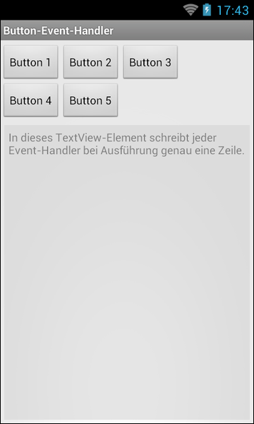

# Android-App "Button-Event-Handler-Möglichkeiten"

App shows different possibilities to implement a button event handler. The only activity of the app contains several buttons, which have their event handler implemented with different methods.

 

Identifiers (names for classes, variables and methods) and UI texts are in German only.

 

----
## Screenshots

  

 

----
# License

See the [LICENSE file](LICENSE.md) for license rights and limitations (BSD 3-Clause License).
