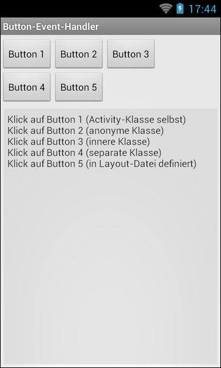

# Android-App "Button-Event-Handler-Möglichkeiten" #

 

Die App zeigt verschiedene Möglichkeiten um einen Button-Event-Handler zu implementieren.

 

----

## Screenshots ##

 

 &nbsp; 

 

----

## License ##

 

See the [LICENSE file](LICENSE.md) for license rights and limitations (BSD 3-Clause License).

 